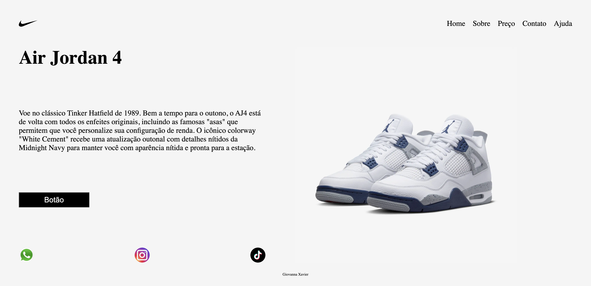

# Divulgação - Air Jordan 4

---
## Sobre
Este projeto consiste em uma página web desenvolvida para divulgar o icônico tênis Air Jordan 4. A página foi criada como parte de um projeto escolar, utilizando HTML e CSS para proporcionar uma apresentação visual atraente e informativa. O objetivo deste projeto é colocar em prática os conhecimentos adquiridos sobre as linguagens de marcação , HTML, CSS e markdown, durante o curso Técnico em Desenvolvimento de Sistemas do [SENAI Jandira](https://sp.senai.br/unidade/jandira/).

---

## Tecnologias utilizadas
- HTML
- CSS
- Markdown
- Git

---

## Autor

- [Giovanna Xavier](https://www.linkedin.com/in/giovanna-xavier-978538241/)